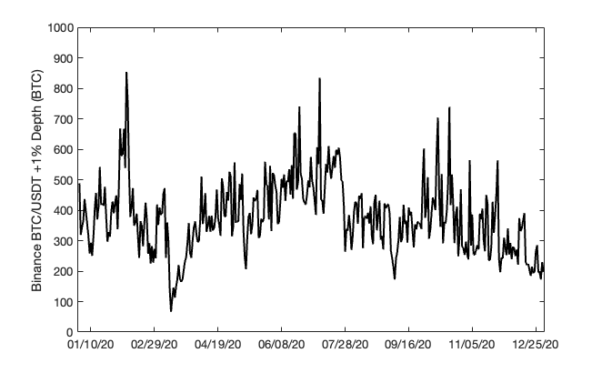
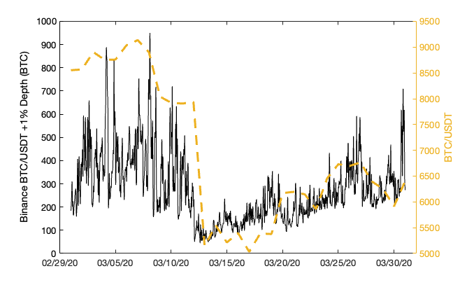
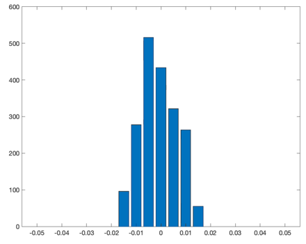
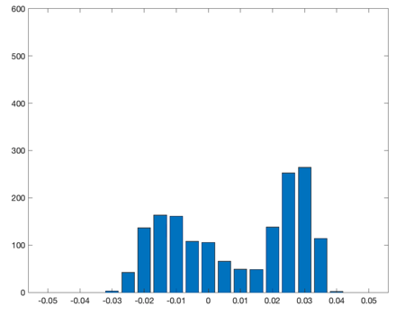
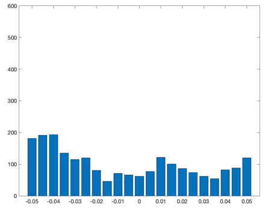
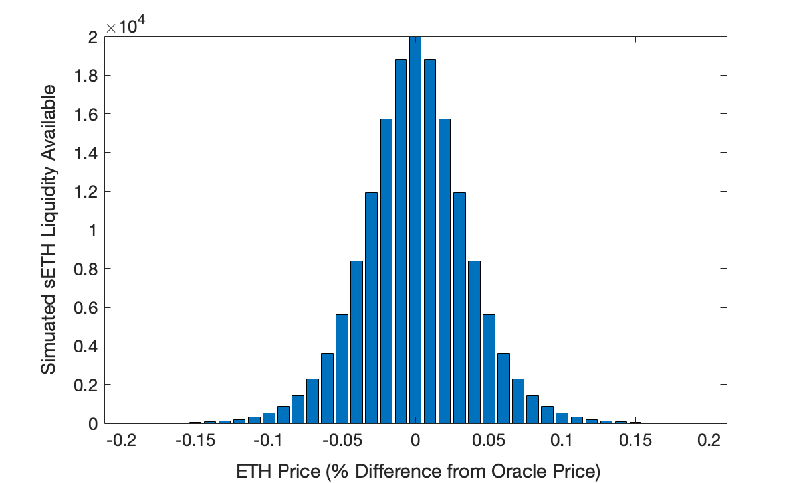
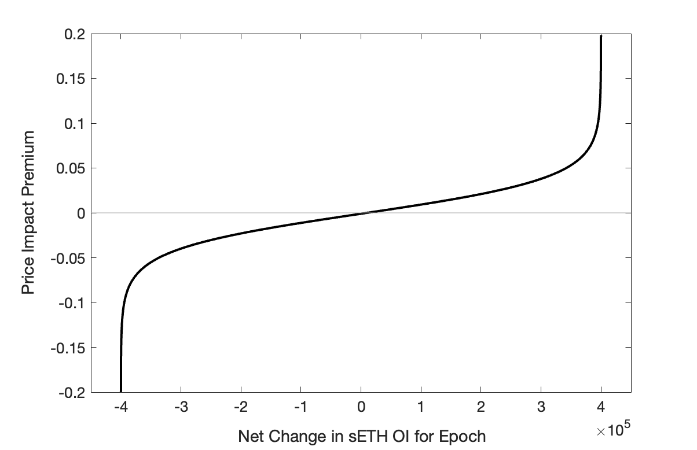

## Simple Summary
<!--"If you can't explain it simply, you don't understand it well enough." Simply describe the outcome the proposed changes intends to achieve. This should be non-technical and accessible to a casual community member.-->
Fill exchanges on Synthetix at the oracle price plus a price impact premium dependent on order size. 

## Abstract
<!--A short (~200 word) description of the proposed change, the abstract should clearly describe the proposed change. This is what *will* be done if the SIP is implemented, not *why* it should be done or *how* it will be done. If the SIP proposes deploying a new contract, write, "we propose to deploy a new contract that will do x".-->
This SIP proposes the implementation of a synthetic pricing curve with parametric liquidity constants set to reflect the global liquidity available for each synth’s underlying asset. Prices are quoted based on the net change in open interest each epoch and are re-centered around the oracle price at the beginning of each epoch. 

## Motivation
<!--This is the problem statement. This is the *why* of the SIP. It should clearly explain *why* the current state of the protocol is inadequate.  It is critical that you explain *why* the change is needed, if the SIP proposes changing how something is calculated, you must address *why* the current calculation is innaccurate or wrong. This is not the place to describe how the SIP will address the issue!-->

Trades on Synthetix are currently filled at the current oracle price, regardless of asset or trade size. This opens up a number of vulnerabilities that make it difficult to scale the diversity and supply of synths. These vulnerabilities can be largely eliminated by upgrading the current exchange mechanism with a pricing function that levies an additional price impact premium based on the size of an order. To ensure that users are still getting the best price execution and liquidity on Synthetix, the parameters for this function will be set to replicate global liquidity available for each synth’s underlying asset. 

## Specification
<!--The specification should describe the syntax and semantics of any new feature, there are five sections
1. Overview
2. Rationale
3. Technical Specification
4. Test Cases
5. Configurable Values
-->

### Overview
<!--This is a high level overview of *how* the SIP will solve the problem. The overview should clearly describe how the new feature will be implemented.-->
Here, epochs are defined as the period of time between oracle updates. At the beginning of each epoch, the pricing function is centered around the current oracle price. Prices are quoted as a +/- premium relative to the current oracle price (plus base exchange fee) and is a function of the net change in open interest during the current epoch. Between oracle updates, execution of trades moves the quote price along the pricing curve; at the end of the epoch, the curve is re-centered around the new oracle price.  

### Rationale
<!--This is where you explain the reasoning behind how you propose to solve the problem. Why did you propose to implement the change in this way, what were the considerations and trade-offs. The rationale fleshes out what motivated the design and why particular design decisions were made. It should describe alternate designs that were considered and related work. The rationale may also provide evidence of consensus within the community, and should discuss important objections or concerns raised during discussion.-->

This mechanism has several safety and usability benefits:

 1. Provides far better price execution on Synthetix than any other venue 
 2. Simplifies the process and feasibility of adding support for new assets
 3. Builds in resistance to order splitting exploits
 4. Prevents other economic exploits related to market manipulation

Another beneficial property of this framework is the limitation of toxic flow. While low fees and no fee reclamation may be tenable in the vast majorities of market conditions, periods of high volatility will allow traders to earn risk free profit limited only by the supply of synths. This mechanism lowers the extractable value from such situations by at least an order of magnitude. To illustrate, consider the following situation:

 1. ETH trading at $2000, Chainlink oracle price $2000
 2. ETH trading at $2014, Chainlink oracle price $2000
 3. Trader longs sETH at $2000 before oracle update
 4. Trader closes long at $2014 after oracle update

In this case, the price of ETH moves by 70bp before the oracle updates. With 30bp fees trading into and out of sETH, 60bp of the gains made on the trade will be paid in fees; the remaining 10bp is risk-free profit. With no price impact, this strategy can be carried out at any size limited only by the available supply of synths. With the framework proposed here, the maximum amount of capital that can be deployed to front-run the oracle update is limited to the amount of 10bp depth quoted by Synthetix (likely ~5-10M sUSD). So the maximum value to be extracted by the frontrunner is ~5-10k sUSD. Limiting frontrunner-extractable-value to defined quantities reduces risk to the system and allows for a more quantitative cost/benefit analysis of the trade-offs between lowering fees to attract more volume and incurring some basal level of expense due to toxic flow. 

### Technical Specification
<!--The technical specification should outline the public API of the changes proposed. That is, changes to any of the interfaces Synthetix currently exposes or the creations of new ones.-->
This model assumes that global liquidity is of the form:

\\(L(p) = \frac{e^{- p}}{\left( e^{- p} + 1 \right)^{2}}\\)

where \\(L\\) is the amount of liquidity available at price \\(p\\) (see
supplemental material for figures). Prices are then quoted as a premium
relative to the oracle price, which is derived from the liquidity
profile above and is of the form:

\\(P(n) = - {\mathbf{λ}}*log\left( \frac{\delta - n}{\delta + n} \right)\\\)

where \\(n\\) is the net change in open interest during a given epoch,
\\(\delta\\) is the maximum allowable change in open interest per epoch, and
\\(\lambda\\) is a liquidity constant that corresponds to the price impact
quoted for an order of size \\(\frac{e - 1}{e + 1}\delta\\) (see
supplemental material for figures).

Accordingly, the price \\(q(s)\\) quoted for an order of size \\(s\\) is the
average value of the price function over the course of the order's
execution relative to the oracle price:

evaluated from \\(n\\) to \\(n + s\\), where \\(O\\) is the current oracle price. In
practice, liquidity should be parameterized to mimic global liquidity
available in the underlying market, less some margin of safety (e.g.
20%). For instance, if there is $10M of +2% order book depth across all
markets for a given synth, Synthetix would quote a 1.2% premium to the
oracle price for a $10M buy.

It is worth noting that in this regime, exchanges between non-sUSD
synths should assess a price impact for trading out of the source synth
into sUSD, and an additional premium for trading into the destination
synth from sUSD. Additionally, if fee reclamation is turned off, this
mechanism should include a feature that allows users to specify a
maximum allowed slippage.

### Test Cases
<!--Test cases for an implementation are mandatory for SIPs but can be included with the implementation..-->
Consider the following parameter set at the beginning of an epoch with
no other trading activity:
{sETH: \\({\mathbf{λ}} = 0.02,\ \delta = 150000\\)}

1.  ETH oracle price is $2000. User wants to buy 20000 sETH with sUSD

-   Change in OI, \\(n = 20000\\)

-   Pricing function after, \\(P(20000) = 0.00537\\)

-   Mark price after trade, \\(O*(1 + P)\\) = 2010.74 sUSD

-   Quote price, \\(q(20000) = 2000*1.0022675 = \$2005.349\\) sUSD

-   Total cost of 40,106,985 sUSD; Net price impact of ~27 bp (vs 80 bp on 1inch)

### Configurable Values (Via SCCP)
<!--Please list all values configurable via SCCP under this implementation.-->
Liquidity parameters set depending on globally available liquidity for
each synth's underlying markets.

-   Liquidity constant (\\(\lambda\\))

-   OI rate limit (\\(\delta\\))

### Supporting Research

An important consideration for the viability of this framework is the
variability of global liquidity over time and if it is amenable to
periodic updates via SCCP. To illustrate, we examine BTC/USDT liquidity
on Binance for all of 2020 (most liquid trading pair on the most liquid
exchange, shown below). Here, we see that liquidity (when measured in
base units rather than quote units) generally does not tend to evolve
too rapidly over time. Note that the data shown below has undergone
substantial smoothing. However, while order book depth is extremely
erratic on short time frames, exploiting relatively small variabilities
between liquidity offered on Synthetix and what is globally available in
spot markets is an extremely risky and expensive exploit vector.

Another important consideration is the evolution of liquidity during
black swan events. As a case study, we examine a close-up of liquidity
available for the trading pair shown above during March 2020. Here, we
see that in black swan events like this, liquidity can deteriorate by as
much as 60-70% in the span of hours to days. Thus, it may be useful to
consider implementing a circuit-breaker or fast track through which
liquidity parameters can be swiftly adjusted in emergency situations.

### Future Work

The implementation proposed here is a crude initial mechanism. Further
research should be done to incorporate more dynamic adaptability of the
market making logic in response to changing market conditions. Some
examples include:

1.  Making liquidity parameters dynamically responsive to price
    movements e.g. lower \\(\lambda\\) or \\(\delta\\) if there are large
    price movements between consecutive oracle updates.

2.  Introducing a variable for skewed liquidity between the bid and ask
    side of an order.

3.  Deforming simulated liquidity to use different profiles depending on
    market conditions determined via SCCP, external data (e.g.
    volatility oracle), etc.

Normal market conditions, Elevated volatility, Extreme volatility.
### Supplemental Material

This model assumes that global liquidity is of the form:

\\(L(p) = \frac{e^{- p}}{\left( e^{- p} + 1 \right)^{2}}\\)

where \\(L\\) is the amount of liquidity available at price \\(p\\).

Prices are then quoted as a premium relative to the oracle price, which
is derived from the liquidity profile above and is of the form:

\\(P(n) = - {\mathbf{λ}}*log\left( \frac{\delta - n}{\delta + n} \right)\\\)

where \\(n\\) is the net change in open interest during a given epoch,
\\(\delta\\) is the maximum allowable change in open interest per epoch, and
\\(\lambda\\) is a liquidity constant that corresponds to the price impact
quoted for an order of size \\(\frac{e - 1}{e + 1}\delta\\).

## Copyright
Copyright and related rights waived via [CC0](https://creativecommons.org/publicdomain/zero/1.0/).
